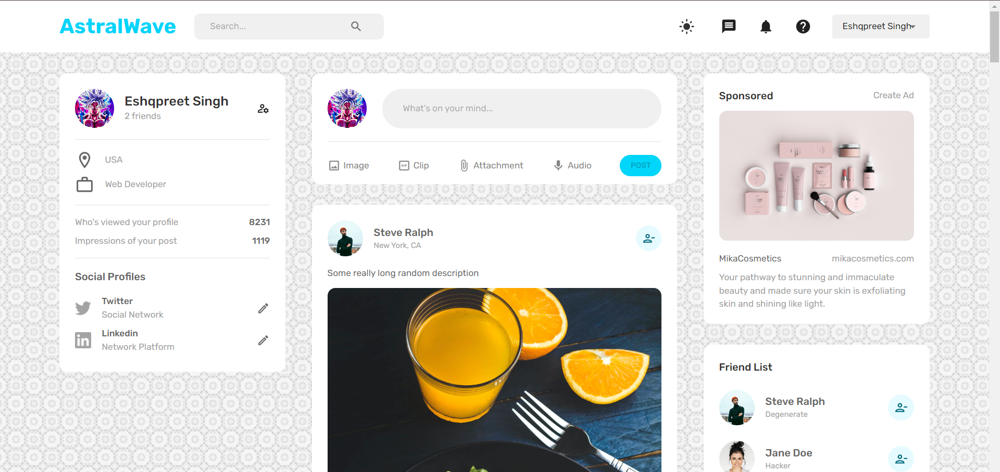
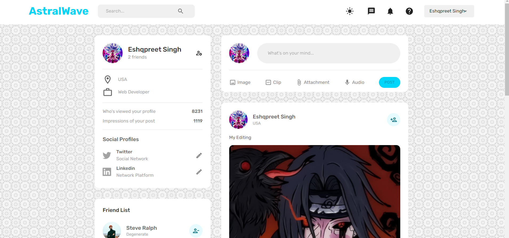
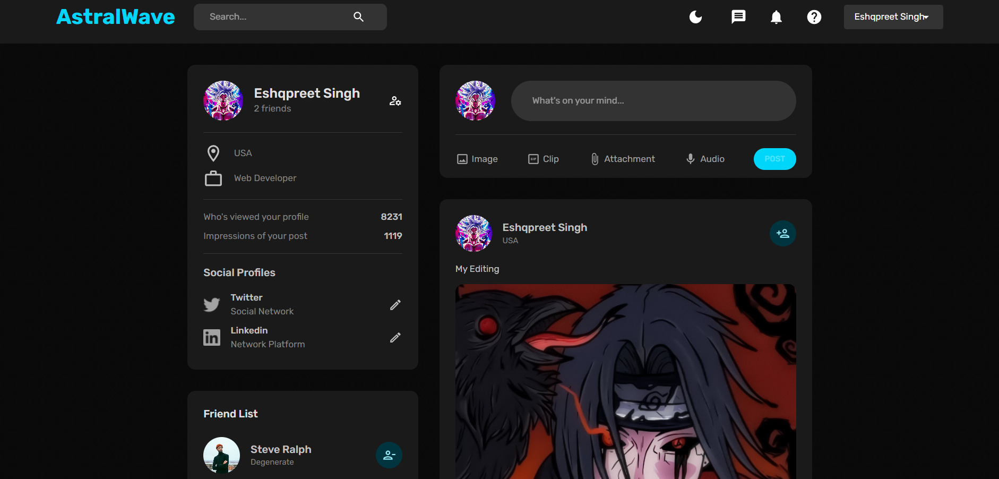

I have created a MERN-based Social Media App, leveraging various technologies and tools to enhance its functionality and aesthetics. Here are the improvements I suggest for your description:

"I have developed an innovative Social Media App using the MERN (MongoDB, Express.js, React, Node.js) stack. This project incorporates several cutting-edge technologies and tools to deliver a seamless user experience.

On the frontend, I utilized React along with React Router for smooth navigation. To ensure robust form handling and validation, I employed formik and yup. For efficient state management, I integrated Redux Toolkit, while Redux with Persistent allowed me to store data locally. Additionally, React Dropzone facilitated easy image uploads.

Moving to the backend, I utilized Node.js and Express.js to build a reliable and scalable server. Mongoose was employed as an object modeling tool for MongoDB, providing a convenient way to interact with the database. To secure the app, I implemented JWT (JSON Web Tokens), ensuring authenticated access. Furthermore, Multer was used for handling file uploads securely.

For the visual aspects of the app, I created a unique logo and favicon using LogoMaker website, ensuring a distinctive brand identity.

Throughout the development process, I drew inspiration from Facebook while infusing my own creative ideas to make this project truly exceptional. Along the way, I acquired valuable knowledge in technologies such as Mui, Redux, JWT, and Multer. I deepened my understanding of these tools by exploring GitHub repositories, watching educational YouTube videos, and studying official documentation from the respective platforms.

Take a glimpse at the app preview:

HomePage: 
ProfilePage:
HomePage with Darkmode: 
Join us today by signing in to become a part of this exciting project.

Link: https://deft-froyo-cf1b25.netlify.app/
# astralwave

